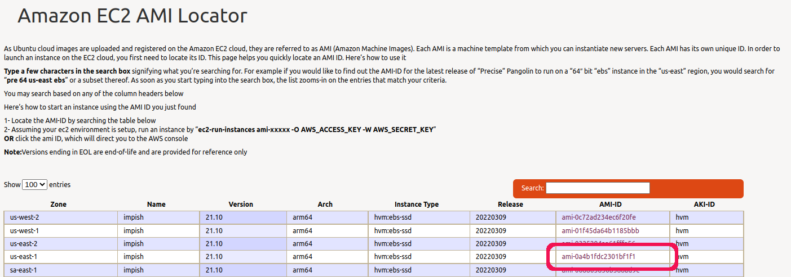

# `aws-image`

## Purpose
Report the details about an Amazon EC2 AMI.

## Syntax
```
Syntax: aws-image AMI
```

## Example
I found the AMI of an image I was interested in by:
- Going to [Amazon EC2 AMI Locator](https://cloud-images.ubuntu.com/locator/ec2/)
- Sorting the table by _Version_, most recent first
- Copying the AMI for version 21.1 for region us-east1
  

```
$ aws-image ami-0a4b1fdc2301bf1f1
{
  "Architecture": "arm64",
  "BlockDeviceMappings": [
    {
      "DeviceName": "/dev/sda1",
      "Ebs": {
        "DeleteOnTermination": true,
        "Encrypted": false,
        "SnapshotId": "snap-03487b50d3f5a0b68",
        "VolumeSize": 8,
        "VolumeType": "gp2"
      }
    },
    {
      "DeviceName": "/dev/sdb",
      "VirtualName": "ephemeral0"
    },
    {
      "DeviceName": "/dev/sdc",
      "VirtualName": "ephemeral1"
    }
  ],
  "CreationDate": "2022-03-09T18:35:39.000Z",
  "Description": "Canonical, Ubuntu, 21.10, arm64 impish image build on 2022-03-09",
  "EnaSupport": true,
  "Hypervisor": "xen",
  "ImageId": "ami-0a4b1fdc2301bf1f1",
  "ImageLocation": "099720109477/ubuntu/images/hvm-ssd/ubuntu-impish-21.10-arm64-server-20220309",
  "ImageType": "machine",
  "Name": "ubuntu/images/hvm-ssd/ubuntu-impish-21.10-arm64-server-20220309",
  "OwnerId": "099720109477",
  "PlatformDetails": "Linux/UNIX",
  "Public": true,
  "RootDeviceName": "/dev/sda1",
  "RootDeviceType": "ebs",
  "SriovNetSupport": "simple",
  "State": "available",
  "UsageOperation": "RunInstances",
  "VirtualizationType": "hvm"
}
$ 
```

## Notes

- This script uses the [aws CLI](https://aws.amazon.com/cli/) and requires that you have installed it and set it up.
- Yes, you could use the `aws` CLI directly to do the same thing but I find it easier to use the script and not have to worry about the syntax of the `aws` command.