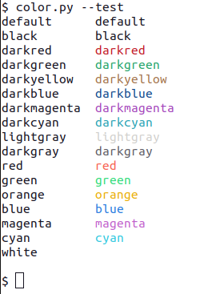
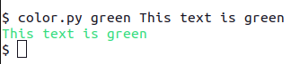
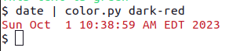
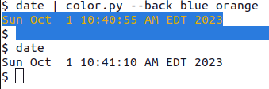
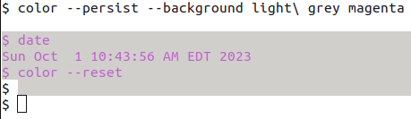
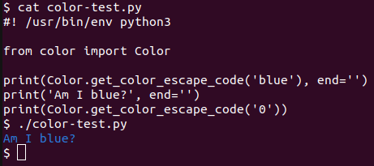

# `color.py`

## Purpose
Display text in various foreground/background colors.

## Syntax
```
usage: color.py [-h] [--test] [-r] [-b BACKGROUND_COLOR] [-p] [-v] [color] [text ...]

Print text in the specified color

positional arguments:
  color                 Choose a foreground color: default, black, darkred, darkgreen, darkyellow, darkblue, darkmagenta, darkcyan, lightgray, darkgray, red, green,
                        orange, blue, magenta, cyan, white
  text                  Text to display

options:
  -h, --help            show this help message and exit
  --test                Test all colors
  -r, --reset           Reset a console to default color only
  -b BACKGROUND_COLOR, --background-color BACKGROUND_COLOR
                        Choose a background color: default, black, darkred, darkgreen, darkyellow, darkblue, darkmagenta, darkcyan, lightgray, darkgray, red, green,
                        orange, blue, magenta, cyan, white
  -p, --persist         Set a console to the specified color
  -v, --verbose         Enable debugging
```

### Positional arguments
| Argument | Description                      | Default                                                                                                                                                                       |
|----------|----------------------------------|-------------------------------------------------------------------------------------------------------------------------------------------------------------------------------|
| `color`  | The foreground color.  Choices: <ul><li>black</li><li>blue</li><li>cyan</li><li>darkblue</li><li>darkcyan</li><li>darkgray</li><li>darkgreen</li><li>darkmagenta</li><li>darkred</li><li>darkyellow</li><li>default</li><li>green</li><li>lightgray</li><li>magenta</li><li>orange</li><li>red</li><li>white</li></ul> | None, the foreground color is required                                                                                                                                        |
| `text`   | Text to display                  | If not specified, the script will read text from stdin.  Either `text` must be specified or stdin must be directed - the script will not read text directly from the terminal |


### Options
| Option               | Description                                                          | Default                                                    |
|----------------------|----------------------------------------------------------------------|------------------------------------------------------------|
| `--test`             | Displays sample colors                                               | The default is to print custom text in the specified color |
| `--reset`            | Reset the foreground/background colors o the default                 | The default is to print custom text in the specified color |
| `--background-color` | Specifies the background color                                       | The default is use the current background color            |
| `--presist`          | Sets foreground/background colors permanently until changed or reset | The default is to print custom text in the specified color |
| `-v`                 | Enable verbose debugging                                             | Debugging is not enabled                                   |

## Examples

### `--test`



Note: The background is white so the white text doesn't appear!

### Text from command line



### Text from command line



### Background color



Note: I'm not crazy about the lingering background color when the prompt returns.  It doesn't seem to linger long... at least you don't have to use `--reset`!

### `--persist` and `--reset` options



### As a class

The class could be used by another script - in fact, that's how the `--color` option of the [`banner`](../banner.md) does just that!



Note: It helps when `color.py` is in the **same directory** as the script using the class.  I often do that as a symbolic link:

```
$ ln -s ~/bin/color.py .
$
```

## Notes

- I typically use the script without the `.py` extension through the use of a very simple alias in my `~/.bashrc` bash login script:
  ```commandline
  alias color=color.py
  ```
- The color names are pretty flexible:
    - A color such as `lightgrey` can be expressed as `light-grey`, `light gray` (_that's not a typo!_), or even its shortest abbreviation such as `lightg`
    - Ambiguous colors result in an error:
      ```
      $ date | color b
      usage: color.py [-h] [--test] [-r] [-b BACKGROUND_COLOR] [-p] [-v] [color] [text ...]
      color.py: error: argument color: 'b' is ambiguous: black, blue
      $
      ``` 
