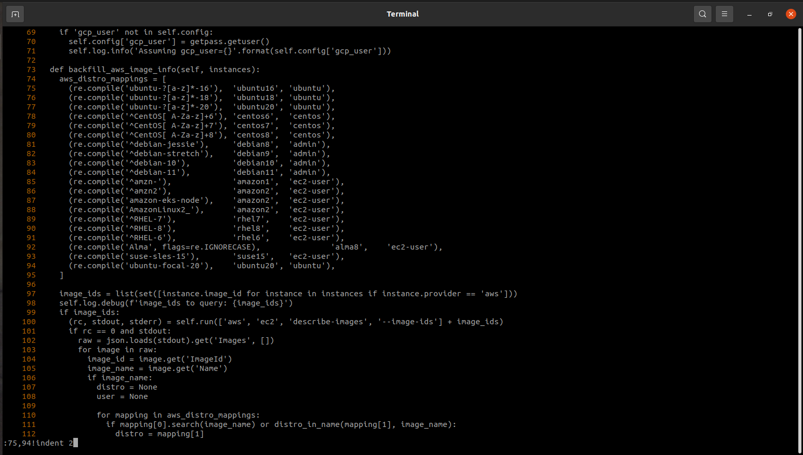
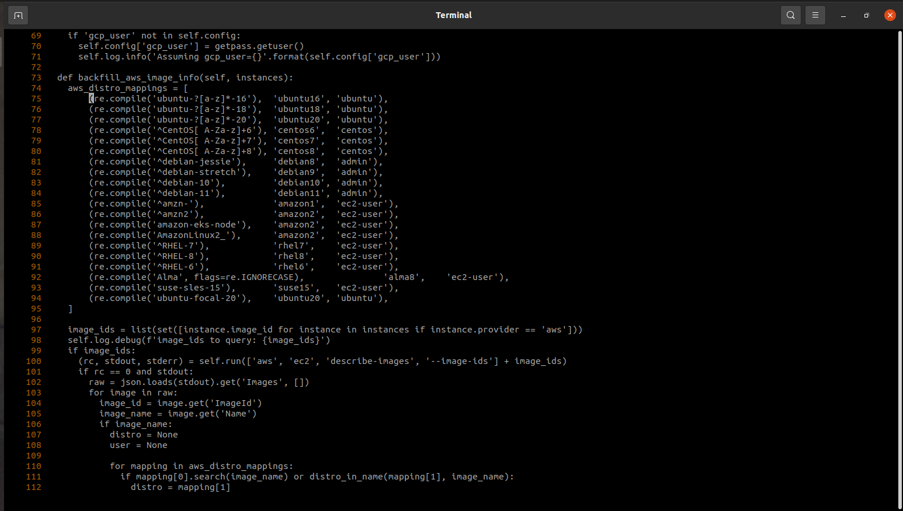

# `indent`

## Purpose
Indent stdin a specific number of spaces.  This pads all lines on the left side. 

## Syntax
```
Syntax: indent NUM
```

### Options and arguments
There are no options.

The only argument is a positive integer which indicates the number of columns to indent

## Examples

### Simple changes
```
$ date | indent 2
  Sat Feb 23 07:35:47 EST 2019
$ date | banner | indent 4
    ┏━━━━━━━━━━━━━━━━━━━━━━━━━━━━━━┓
    ┃ Sat Feb 23 07:36:00 EST 2019 ┃
    ┗━━━━━━━━━━━━━━━━━━━━━━━━━━━━━━┛
$ 
```

### `vi` command
I often use this script inside `vi` to indent a portion of code:

#### Before running command
Note the command at the bottom of the screen.


#### After running command


## Notes

- The tool only reads lines from stdin.  You must redirect the input from a file, pipe, or _here document_.
