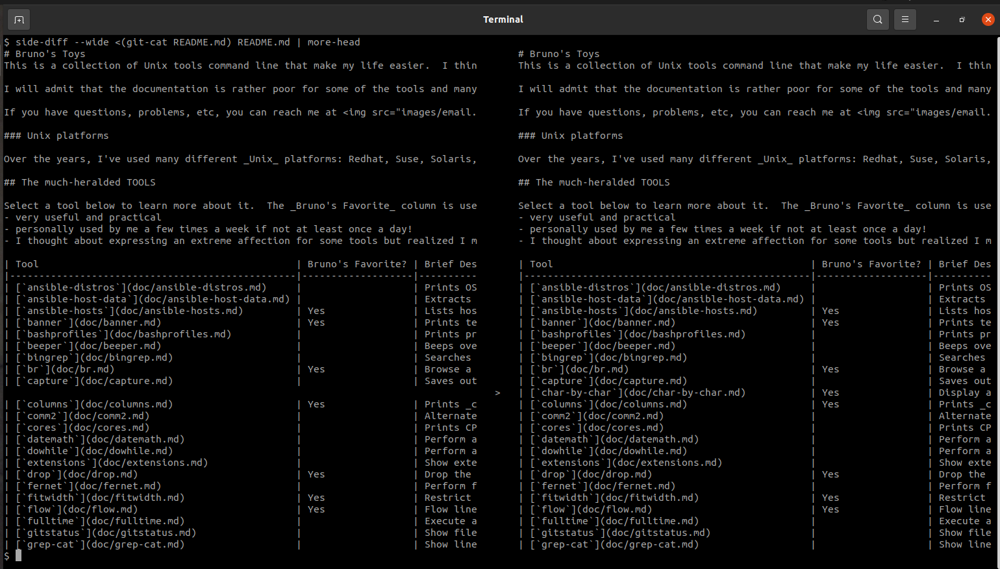
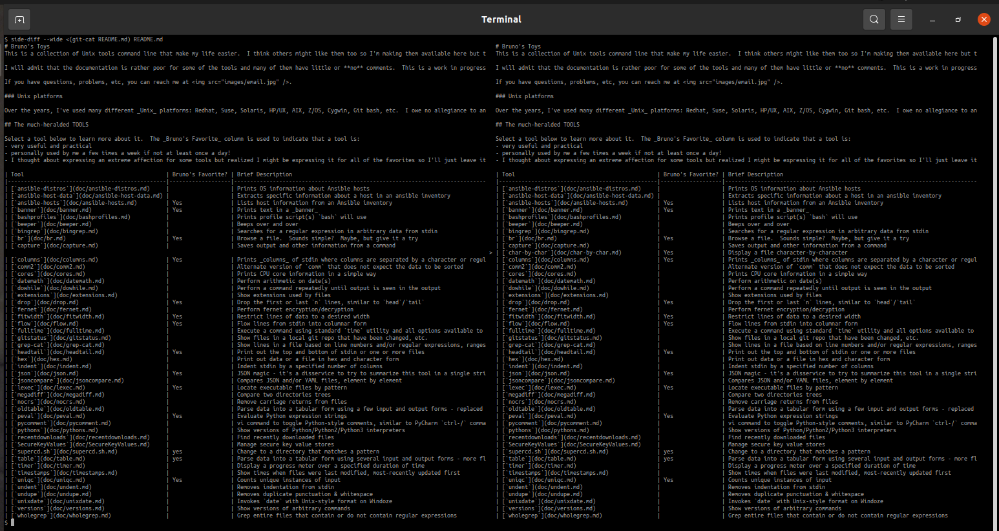

# `side-diff`

## Purpose
This script leverages the `diff --side-by-side` option but its biggest strength is the ability to automatically detect the width of the shell window and adjust the output to fit the screen. 

## Syntax
```
Syntax: side-diff [--verbose] [--wide] [--width WIDTH] [--ignore-space-change] file1 file2
```

### Options and arguments
| Option                        | Description                                                | Default                                   |
|-------------------------------|------------------------------------------------------------|-------------------------------------------|
| `--wide`                      | Use the entire width of the screen                         | `diff` has a default width it will use    |
| `--width WIDTH`               | The specified width is used, regardless of the screen size | `diff` has a default width it will use    |
| `-b`, `--ignore-space-change` | Ignore changes in whitespace                               | Differences in whitespace are not ignored |
| `-v`                          | Enable verbose debugging                                   | Debugging is not enabled                  |

## Example

I will use a command like the following:

    $ side-diff --wide <(git-cat master README.md) README.md | more-head

[`git-cat`](git-cat.md) and [`more-head`](more-head.md) are other tools of mine in this repository.

### Default width


### Zoomed in


## Notes

- `--wide` and `--width` are mutually exclusive
- Often when I'm reading output from the script at a screen, I will reduce the size of the screen font to get more on the screen.  I usually have to restore it soon but if I don't reduce the size, `diff` can hide some of the content of long lines from the files.
- `--width` is especially useful when redirecting the output to a file, not to the screen
